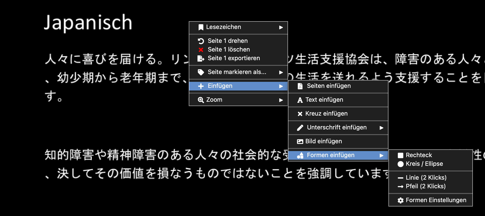
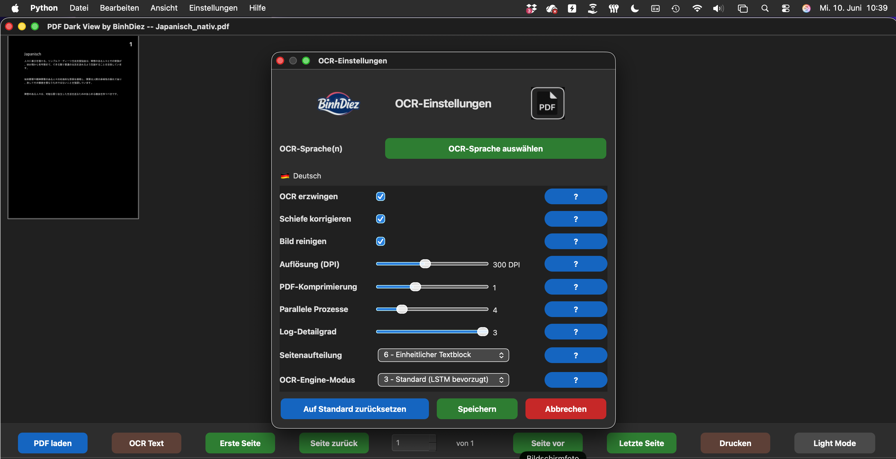
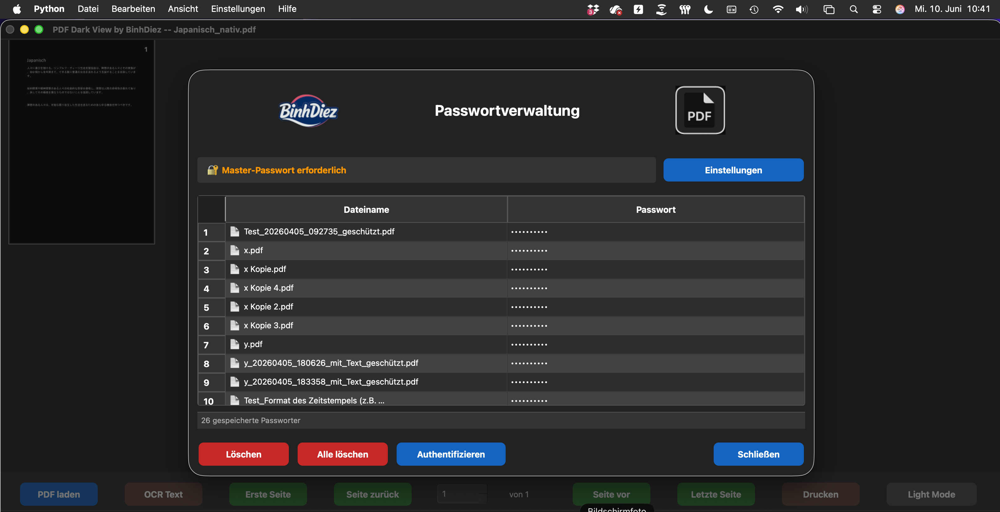

# PDFDarkView – PDF Editing Made Easy (Open Source)

  

### Beschreibung / Description / Mô tả

<h2>
  <a href="#lang-de">🇩🇪 Deutsch</a> •
  <a href="#lang-en">🇬🇧 English</a> •
  <a href="#lang-vi">🇻🇳 Tiếng Việt</a>
</h2>

---

<strong>🇩🇪 Deutsch</strong>

## Beschreibung

**PDFDarkView** ist ein kostenloser Open-Source-PDF-Viewer und PDF-Editor für **macOS und Windows** mit OCR, Barrierefreiheitsfunktionen, Text-to-Speech, Mehrsprachigkeit und umfangreichen Werkzeugen zur PDF-Bearbeitung.

Die Anwendung vereint PDF-Anzeige, Bearbeitung, OCR-Texterkennung, Dokumentkonvertierung, Barrierefreiheit und PDF-Optimierung in einer einzigen Software – sowohl für den täglichen Einsatz als auch für Nutzer mit Sehbeeinträchtigungen.

# Funktionen

## Kernfunktionen

| Funktion | Beschreibung |
|----------|--------------|
| PDF-Anzeige | PDF-Dokumente öffnen und komfortabel durchsuchen |
| PDF-Bearbeitung | Inhalte direkt in PDFs einfügen und bearbeiten |
| OCR-Unterstützung | Texterkennung mit Tesseract OCR |
| Volltextsuche | Dokumentinhalte schnell durchsuchen |
| Lesezeichen | Erstellen, verwalten und navigieren |
| Textfenster | Extrahierten Dokumenttext anzeigen |
| Dark Mode & Light Mode | Angenehme Darstellung in jeder Umgebung |
| Mehrsprachige Oberfläche | Verfügbar in 64 Sprachen |
| Barrierefreiheit | Optimiert für sehbehinderte und blinde Nutzer |

## Bearbeitungswerkzeuge

### Elemente einfügen

- Text
- Bild
- Signatur (passwortgeschützt)
- Häkchen
- Rechteck
- Ellipse
- Linie
- Pfeil
- Seitenzahlen
- Text-Wasserzeichen
- Bild-Wasserzeichen

### Redaktion (Schwärzen)

- Schwarze Schwärzung
- Weiße Schwärzung

## Seitenverwaltung

- Seite drehen
- Alle Seiten drehen
- Seitenausrichtung normalisieren
- Alle Seiten normalisieren
- Seiten löschen
- Seiten extrahieren
- Seiten einfügen
- Seiten verschieben
- Seitengröße ändern
- N-Up (mehrere Seiten pro Blatt)

## PDF-Verarbeitung

- PDFs zusammenführen
- PDFs überlagern
- PDFs zuschneiden
- PDFs abflachen (Flatten)
- PDFs optimieren
- In PDF/A konvertieren
- Dokumente schützen

## Export & Konvertierung

- Apple Pages
- DOCX
- TXT
- Seiten als Bilder exportieren
- Eingebettete Bilder extrahieren

## Metadaten

- Metadaten anzeigen
- Metadaten bearbeiten

## Einstellungen

### Allgemein

- OCR-Konfiguration
- Text-to-Speech-Einstellungen
- Passwortverwaltung
- Signatureinstellungen
- Backup-Einstellungen
- Dateinamenformatierung

### Darstellung

- Dark Mode
- Farbumkehr
- Einstellbarer Graustufen-Schwellwert

### Konfiguration

- Exporteinstellungen
- Importeinstellungen
- Anwendungssprache ändern
- 64 verfügbare Sprachen

## Barrierefreiheit

- Text-to-Speech
- Dark Mode
- Farbumkehr
- Einstellbarer Graustufen-Schwellwert
- Große Zoomstufen
- Vollständige Tastaturbedienung
- Mehrsprachige Benutzeroberfläche

---

## Description

<strong>🇬🇧 English</strong>

**PDFDarkView** is a free open-source PDF viewer and editor for **macOS and Windows**, featuring OCR, accessibility tools, text-to-speech, multilingual support, and a comprehensive set of PDF editing features.

It combines PDF viewing, editing, OCR text recognition, document conversion, accessibility enhancements, and PDF optimization into a single application for everyday use and users with visual impairments.

## Core Features

| Feature | Description |
|---------|-------------|
| PDF Viewer | Open and browse PDF documents |
| PDF Editing | Insert and edit content directly in PDFs |
| OCR Support | Text recognition powered by Tesseract OCR |
| Full-Text Search | Quickly search document contents |
| Bookmarks | Create, manage, and navigate bookmarks |
| Text Window | Display extracted document text |
| Dark & Light Mode | Comfortable viewing in any environment |
| Multilingual Interface | Available in 64 languages |
| Accessibility | Optimized for visually impaired and blind users |

## Editing Tools

### Insert Elements

- Text
- Image
- Password-protected signature
- Checkmark
- Rectangle
- Ellipse
- Line
- Arrow
- Page numbers
- Text watermark
- Image watermark

### Redaction

- Black redaction
- White redaction

## Page Management

- Rotate pages
- Rotate all pages
- Normalize page orientation
- Delete pages
- Extract pages
- Insert pages
- Move pages
- Resize pages
- N-Up layout

## PDF Processing

- Merge PDFs
- Overlay PDFs
- Crop PDFs
- Flatten PDFs
- Optimize PDFs
- Convert to PDF/A
- Protect documents

## Export & Conversion

- Apple Pages
- DOCX
- TXT
- Export pages as images
- Extract embedded images

## Metadata

- View metadata
- Edit metadata

## Settings

### General

- OCR configuration
- Text-to-Speech settings
- Password management
- Signature settings
- Backup settings
- Filename formatting

### Appearance

- Dark Mode
- Color inversion
- Adjustable grayscale threshold

### Configuration

- Export settings
- Import settings
- Change application language
- 64 available languages

## Accessibility

- Text-to-Speech
- Dark Mode
- Color inversion
- Adjustable grayscale threshold
- High zoom levels
- Full keyboard navigation
- Multilingual user interface

---

## Mô tả

<strong>🇻🇳 Tiếng Việt</strong>

**PDFDarkView** là trình xem và chỉnh sửa PDF mã nguồn mở miễn phí dành cho **macOS và Windows**, tích hợp OCR, các tính năng hỗ trợ tiếp cận, chuyển văn bản thành giọng nói, hỗ trợ đa ngôn ngữ và bộ công cụ chỉnh sửa PDF đầy đủ.

Ứng dụng kết hợp xem PDF, chỉnh sửa, nhận dạng văn bản OCR, chuyển đổi tài liệu, cải thiện khả năng tiếp cận và tối ưu hóa PDF trong một phần mềm duy nhất.

## Tính năng chính

| Tính năng | Mô tả |
|-----------|------|
| Xem PDF | Mở và duyệt tài liệu PDF |
| Chỉnh sửa PDF | Chèn và chỉnh sửa nội dung trực tiếp |
| Hỗ trợ OCR | Nhận dạng văn bản bằng Tesseract OCR |
| Tìm kiếm toàn văn | Tìm kiếm nội dung nhanh chóng |
| Dấu trang | Tạo và quản lý dấu trang |
| Cửa sổ văn bản | Hiển thị văn bản đã trích xuất |
| Chế độ Sáng & Tối | Hiển thị thoải mái trong mọi môi trường |
| Giao diện đa ngôn ngữ | Hỗ trợ 64 ngôn ngữ |
| Hỗ trợ tiếp cận | Tối ưu cho người khiếm thị và mù |

## Công cụ chỉnh sửa

### Chèn thành phần

- Văn bản
- Hình ảnh
- Chữ ký có mật khẩu
- Dấu tích
- Hình chữ nhật
- Hình elip
- Đường thẳng
- Mũi tên
- Số trang
- Watermark văn bản
- Watermark hình ảnh

### Che nội dung

- Che màu đen
- Che màu trắng

## Quản lý trang

- Xoay trang
- Xoay toàn bộ trang
- Chuẩn hóa hướng trang
- Xóa trang
- Trích xuất trang
- Chèn trang
- Di chuyển trang
- Thay đổi kích thước trang
- N-Up

## Xử lý PDF

- Gộp PDF
- Chồng PDF
- Cắt PDF
- Làm phẳng PDF
- Tối ưu PDF
- Chuyển sang PDF/A
- Bảo vệ tài liệu

## Xuất & Chuyển đổi

- Apple Pages
- DOCX
- TXT
- Xuất trang thành hình ảnh
- Trích xuất hình ảnh nhúng

## Siêu dữ liệu

- Xem siêu dữ liệu
- Chỉnh sửa siêu dữ liệu

## Cài đặt

### Chung

- Cấu hình OCR
- Cài đặt Text-to-Speech
- Quản lý mật khẩu
- Cài đặt chữ ký
- Cài đặt sao lưu
- Định dạng tên tệp

### Hiển thị

- Chế độ tối
- Đảo màu
- Ngưỡng thang xám có thể điều chỉnh

### Cấu hình

- Cài đặt xuất
- Cài đặt nhập
- Thay đổi ngôn ngữ ứng dụng
- 64 ngôn ngữ được hỗ trợ

## Hỗ trợ tiếp cận

- Text-to-Speech
- Chế độ tối
- Đảo màu
- Ngưỡng thang xám có thể điều chỉnh
- Thu phóng lớn
- Điều khiển hoàn toàn bằng bàn phím
- Giao diện đa ngôn ngữ

---

🔄 Versionsverlauf / Change Log / Lịch sử phiên bản

## Version 2.4.5

### Verbesserungen

- Weitere Zeitoptimierung durch Lazy Import`s

### Fehlerbehebungen

- Diverse Bugfixes

---

## Version 2.4.4

### Neu

- Dateisuffixe mit optionalem Benutzernamen

### Verbesserungen

- Weitere Zeitmessungen zur Performanceanalyse

### Fehlerbehebungen

- Diverse Bugfixes

---

## Version 2.4.3

### Neu

- Neue Sprache: Esperanto

### Verbesserungen

- Drucken unter Windows nutzt jetzt eine dafür geeignete Anwendung (Adobe Acrobat, Edge, Firefox, Foxit ...)

---

## Version 2.4.2

### Startzeit deutlich reduziert

Insbesondere im Netzwerk- und Citrix-Betrieb wurde die Startzeit erheblich verkürzt.

**Optimierungen**

- `shutil.which()` wird zuerst verwendet (kein Prozessstart, schneller Systemaufruf)
- Timeouts für `subprocess.run()` verhindern Blockaden von über zwei Sekunden pro Befehl
- Direkte Pfadlisten ersetzen aufwändige `subprocess`-Aufrufe
- Bundle-Pfade werden vor der Systemsuche bevorzugt
- Im Bundle-Modus entfällt die aufwändige Systemsuche vollständig
- Zeitmessungen werden im Log als **TIMING** protokolliert

---

## Version 2.4.1

### Neu

- Gerade und ungerade Seiten löschen

### Verbesserungen

- Dateisuffixe werden nun immer ersetzt
- Optionales Beibehalten wurde entfernt, um überlange Dateinamen zu verhindern
- Standard-OCR-Sprache entspricht automatisch der Sprache der Benutzeroberfläche

---

## Version 2.3.1

### Fehlerbehebungen

- Verbesserter PDF-Start per Doppelklick
- Optimiertes Logging

---

## Version 2.2.0

### Neu

- Verbesserte OCR-Erkennung
- Optimierter Dark Mode
- Updateprüfung beim Programmstart
- Automatische Erkennung der Systemsprache beim ersten Start
- Automatischer Download der Übersetzungen aus dem Repository
- Unterstützung für 64 Sprachen

### Fehlerbehebungen

- Diverse Bugfixes

---

🖥️ Unterstützte Plattformen / Supported platforms / Các nền tảng được hỗ trợ

# Unterstützte Plattformen

| Plattform | Unterstützung |
|-----------|---------------|
| macOS (Intel) | ✅ |
| macOS (Apple Silicon) | ✅ |
| Windows (64-Bit) | ✅ |

---

📸 Screenshots / Ảnh chụp màn hình 

### PDF Bearbeiten / Einfügen (Dark Mode / Light Mode)

### Über PDFDarkView

### OCR Einstellungen

### OCR Textfenster

### Passwortverwaltung

---

🔍 Suchbegriffe / Keywords / Từ khóa

🇩🇪 Deutsch
PDF Viewer, PDF Betrachter, PDF Reader, PDF Editor, PDF bearbeiten, PDF bearbeiten kostenlos, Open Source PDF, kostenlose PDF-Software, OCR, Texterkennung, Dokumentenerkennung, gescannte Dokumente erkennen, PDF durchsuchbar machen, PDF zusammenführen, PDF optimieren, PDF komprimieren, PDF in PDF/A umwandeln, PDF zuschneiden, PDF drehen, Seiten extrahieren, Seiten löschen, Seiten verschieben, Ankreuzen, Bilder einfügen, Formen einfügen, Text einfügen, Unterschrift einfügen, Wasserzeichen einfügen, PDF schwärzen, Dokumente anonymisieren, PDF Signatur, PDF unterschreiben, Metadaten bearbeiten, PDF vorlesen, Text-to-Speech, Barrierefreiheit, Sehbehinderung, Screenreader, Sprachausgabe, Dark Mode, Light Mode, Dunkelmodus, PDF-Software Windows, PDF-Software macOS, Tesseract OCR, GUI-Übersetzung, mehrsprachige Benutzeroberfläche.

🇬🇧 English
PDF Viewer, PDF Viewer, PDF Reader, PDF Editor, Edit PDF, Free PDF Editor, Open Source PDF, Free PDF Software, OCR, Text Recognition, Document Recognition, Recognize Scanned Documents, Make PDF Searchable, Merge PDFs, Optimize PDFs, Compress PDFs, Convert PDF to PDF/A, Crop PDF, Rotate PDF, Extract Pages, Delete Pages, Move Pages, Add Checkmarks, Insert Images, Insert Shapes, Insert Text, Insert Signature, Insert Watermark, Redact PDF, Anonymize Documents, PDF Signature, Sign PDF, Edit Metadata, Read PDF Aloud, Text-to-Speech, Accessibility, Visual Impairment, Screen Reader, Speech Output, Dark Mode, Light Mode, Dark Mode, PDF Software for Windows, PDF Software for macOS, Tesseract OCR, GUI Translation, Multilingual User Interface.

🇻🇳 Tiếng Việt
Trình xem PDF, Trình xem PDF, Trình đọc PDF, Trình chỉnh sửa PDF, Chỉnh sửa PDF, Chỉnh sửa PDF miễn phí, PDF mã nguồn mở, Phần mềm PDF miễn phí, OCR, Nhận dạng văn bản, Nhận dạng tài liệu, Nhận dạng tài liệu được quét, Làm cho PDF có thể tìm kiếm, Gộp PDF, Tối ưu PDF, Nén PDF, Chuyển PDF sang PDF/A, Cắt PDF, Xoay PDF, Trích xuất trang, Xóa trang, Di chuyển trang, Thêm dấu kiểm, Chèn hình ảnh, Chèn hình dạng, Chèn văn bản, Chèn chữ ký, Chèn hình mờ, Che thông tin PDF, Ẩn danh tài liệu, Chữ ký PDF, Ký PDF, Chỉnh sửa siêu dữ liệu, Đọc PDF thành tiếng, Chuyển văn bản thành giọng nói, Hỗ trợ tiếp cận, Khiếm thị, Trình đọc màn hình, Đầu ra giọng nói, Chế độ tối, Chế độ sáng, Chế độ tối, Phần mềm PDF cho Windows, Phần mềm PDF cho macOS, Tesseract OCR, Dịch giao diện đồ họa, Giao diện người dùng đa ngôn ngữ.

---

🛡️ Lizenzen / Licenses / Giấy phép

### 🇩🇪 Deutsch

PDFDarkView wird unter der MIT-Lizenz veröffentlicht.

Dieses Projekt verwendet verschiedene Open-Source-Bibliotheken und Komponenten von Drittanbietern. Diese Abhängigkeiten unterliegen weiterhin ihren jeweiligen Lizenzen und Copyright-Hinweisen.

Die MIT-Lizenz von PDFDarkView gilt ausschließlich für den ursprünglichen Quellcode dieses Projekts und ersetzt oder verändert nicht die Lizenzbedingungen der verwendeten Drittanbieter-Software.

Details zu den verwendeten Komponenten und deren jeweiligen Lizenzen befinden sich in der Datei `THIRD_PARTY_LICENSES.md`.

---

### 🇬🇧 English

PDFDarkView is released under the MIT License.

This project uses a number of third-party open-source libraries and components. These dependencies remain subject to their own licenses and copyright notices.

The MIT License of PDFDarkView applies only to the original source code of this project and does not replace or modify the license terms of any third-party software.

For details regarding third-party components and their respective licenses, please refer to the `THIRD_PARTY_LICENSES.md` file.

---

### 🇻🇳 Tiếng Việt

PDFDarkView được phát hành theo giấy phép MIT.

Giấy phép MIT chỉ áp dụng cho mã nguồn gốc của dự án.

Chi tiết xem trong `THIRD_PARTY_LICENSES.md`.

---

🔒 macOS-Sicherheitshinweis / Gatekeeper Info / Thông báo bảo mật macOS

### 🇩🇪 Deutsch
PDFDarkView ist derzeit nicht mit einem Apple-Developer-Zertifikat signiert.

Beim ersten Start kann macOS Gatekeeper die Ausführung blockieren.

1. App einmal öffnen.
2. Warnung schließen.
3. **Systemeinstellungen → Datenschutz & Sicherheit**
4. Dort ganz nach unten bis zur Warnung "PDFDarkView wurde blockiert..." scrollen.
5. **„Dennoch öffnen“** auswählen
6. Wenn noch einmal gewarnt wird: erneut **„Dennoch öffnen“** auswählen und mit Passwort bestätigen.

---

### 🇬🇧 English
PDFDarkView is currently not signed with an Apple Developer certificate.

When starting the app for the first time, macOS Gatekeeper may block the app from running.

1. Open the app once.
2. Close the warning.
3. **System Settings → Privacy & Security**
4. Scroll all the way down to the warning "PDFDarkView was blocked..." 
5. Select **“Open Anyway”**
6. If you are warned again: select **“Open Anyway”** again and confirm with your password.

---

### 🇻🇳 Tiếng Việt
PDFDarkView hiện chưa được ký bằng chứng chỉ Apple Developer.

Khi khởi động ứng dụng lần đầu tiên, macOS Gatekeeper có thể chặn không cho ứng dụng chạy.

1. Mở ứng dụng một lần.
2. Đóng cảnh báo.
3. **Cài đặt hệ thống → Quyền riêng tư & Bảo mật**
4. Cuộn xuống dưới cùng cho đến khi thấy cảnh báo "PDFDarkView đã bị chặn..."
5. Chọn **“Vẫn mở”**
6. Nếu xuất hiện cảnh báo một lần nữa: chọn lại **“Vẫn mở”** và xác nhận bằng mật khẩu.

---

🖥️ Download-Info / Thông tin tải xuống 

### Download-Versione

| Suffix | Betriebssystem |
|--------|-----------------|
| `_macOS_as` | Apple Silicon (M1–M4) |
| `_macOS_intel` | Intel Macs |
| `_win` | Windows x64 |

> Windows on ARM wird derzeit nicht unterstützt / not supported

### Extract 7z-Archive / Giải nén các tệp lưu trữ 7z

| Betriebssystem | Empfohlene App |
|---------------|----------------|
| 🍎 macOS | **Keka** – <https://www.keka.io/> |
| 🪟 Windows | **7-Zip** – <https://www.7-zip.org/> |

🔑 7z Passwort / password / mật khẩu

**BinhDiez**

